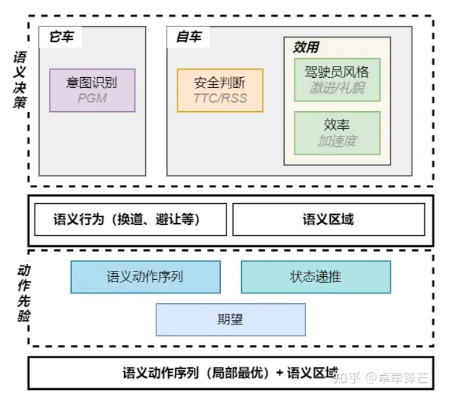
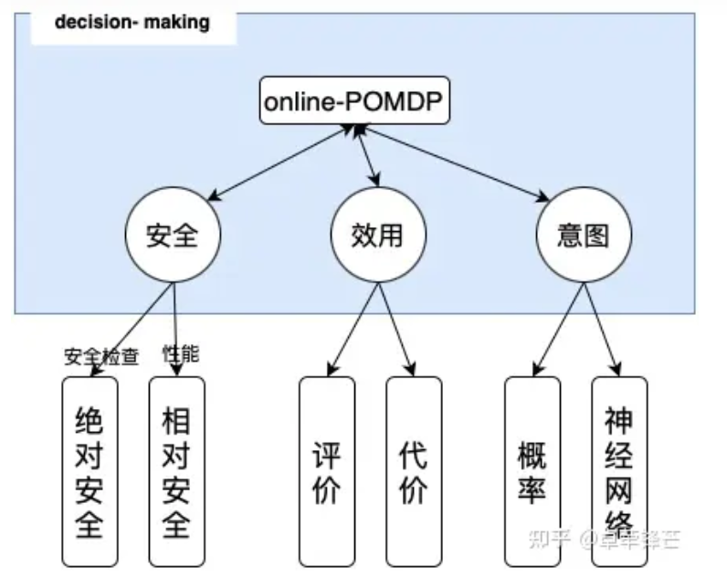

# 决策算法

周围参与者的意图识别 --> Bayesian && 自车安全行为的选择 --> Online-POMDP

参数辨识 --> DL 

MDP -->基于网格插值的MDP算法，

概率图模型,贝叶斯和独立性原理，完成概率计算，

环境决策

模型分为三层：因果层、意图层、观测层

决策框架：

交互搜索

Online-MDP

框架算法设计

MDP、online-POMDP更适合作为框架算法。

Bayesian+MDP+Probabilistic Risk(Constrained)

Bayesian：基于数据得到先验（Prior）概率，然后使用后验（Posterior）概率，保证整个算法的拟人性和可解释性。

MDP：非常适合做交互决策，又能保证局部最优性。

Probabilistic Risk(Constrained)：就功能安全而言，风险的定义包括了风险的发生概率和风险的危害程度。在城市场景下，若自动驾驶做到全路段的话，需要在有约束的概率风险下的做决策。

状态S：采用语义化行为。致使该算法是基于行为的，而不是场景的，泛化能力更强。

自车的状态转移T：采用数据学习(非DNN)+车辆运动学模型的方法，模拟学习自车的规划性能。保证最终的结果符合规划的性能，又避免采用决策+规划的耦合方式的低泛化能力。

它车的状态转移T：采用Bayesian的方法学习和推断它车行为。根据它车的历史信息，使用先验和后验计算状态的转移及对应的概率。根据先验计算状态的转移及概率，避免深度学习、强化学习的不可解释性、低泛化性。

可违背风险的行为(R,A)：基于风险概率选择最优的动作序列。保证拥堵场景的通勤效率。

MDP+LinearProgram+HomotopyClass+Interpolation

control, planning, decision making的统一视角，是最优控制：目标函数 + 动力模型的范式。
control中最优控制对PID和Pure Pursuit的胜利是来源于动力模型的使用。
planning中最优控制对采样的胜利是来源于numerical optimization将给定问题解到最优的能力。
decision making中你提到的MDP，实际上也是目标函数+动力模型的范式，也可以归到最优控制范畴中。其相对于对rule based的胜利，也是来自于动力模型的使用，包括自车和它车。

决策领域使用numerical optimization困难的原因在于，决策问题中考虑的动力模型是随机和分叉的。这让基于梯度的numerical optimization无从下手，只有采样的方式是tractable的，zero-order或者用采样近似梯度。但是其效率和收敛能力都大打折扣，更不必说非凸问题。